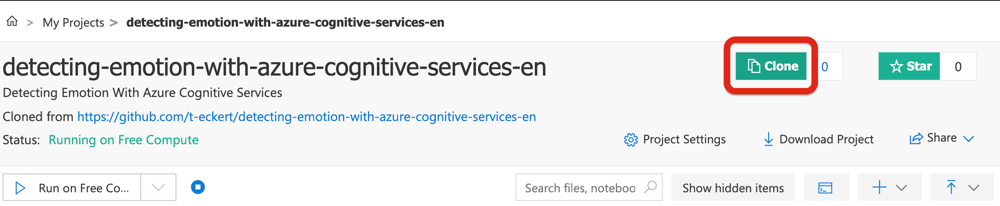
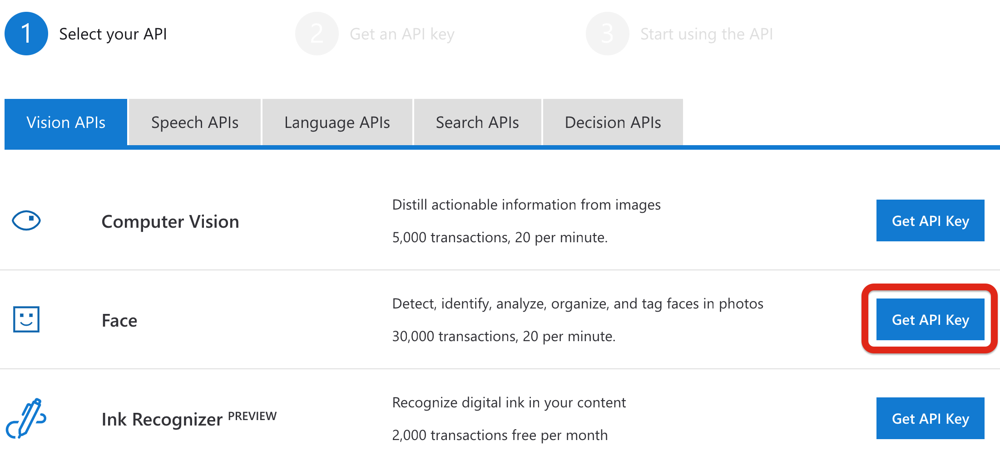
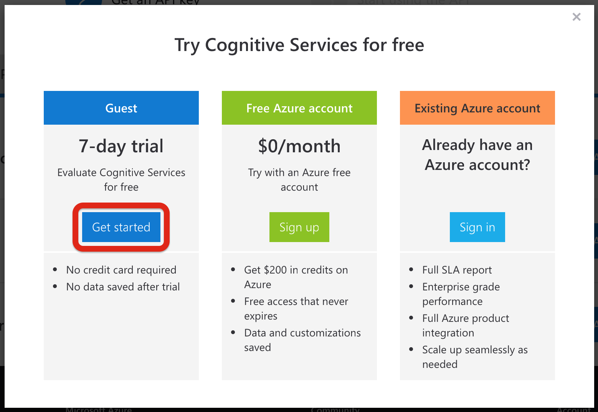
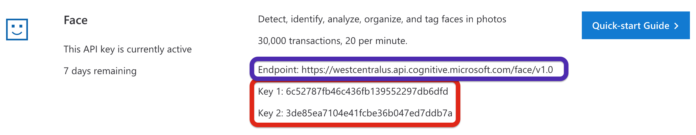
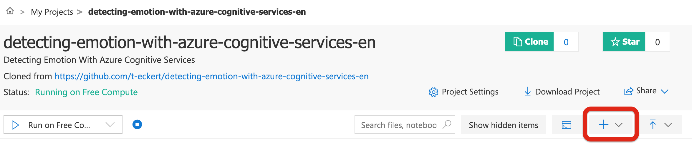
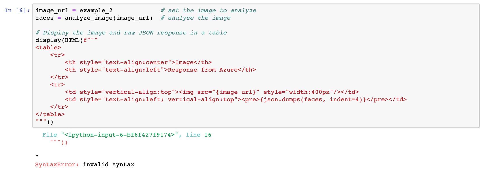

# For Teachers

Aside from being a TA in grad school, I have no formal training as an edu

🗄[GitHub](https://github.com/t-eckert/detecting-emotion-with-azure-cognitive-services-en)  
📓[Azure Notebook](https://notebooks.azure.com/t-eckert/projects/acs-emotion)

Azure is a cloud computing platform from Microsoft. It offers solutions for compute, Internet of things, and machine learning. This lab will take you through using a trained machine learning model for detecting faces in an image and their emotion.  

You will produce a program that can take in a link to any image and display an image with the emotion of the detected faces overlaid on the image.  

<table>
    <tr>
        <td></td>
        <td></td>
    </tr>
    <tr>
        <td></td>
        <td></td>
    </tr>
</table>

## Setup

> If you are using this lab as a teacher in a classroom, see [TEACHERS.md](./TEACHERS.md) for instructions on how to setup the lab for a group of students.

0. Go to [the project](https://notebooks.azure.com/t-eckert/projects/acs-emotion) in Azure Notebooks (You may already be here).
1. Click the `Sign-in` link at the top right of the page. You can use an existing account or create a new one.



If you create a new account, you will be given a set of instructions. You can use your own email address. You will not need a credit card. This is a free service.  

2. Click the `Clone` button at the top of the page: 


In the window that appears, click `Clone` again.  

3. After cloning you will be taken to your own copy of the lab.  

4. In a new tab, go to [Try Azure Cognitive Services](https://azure.microsoft.com/en-us/try/cognitive-services/). In the Face row, click the `Get API Key` button.  



5. In the modal, click the `Get Started` button under Guest. You can sign in with the account you used for setting up Azure Notebooks or use an existing Facebook, LinkedIn, or GitHub account.



6. After signing in, you will be brought to the page shown below. Copy down the `Endpoint` (in purple) and `Keys` (in red) shown on your page.



7. Return to your clone of the lab in the original tab. Click the `+` button to add a file to the lab: 



8. Select `Blank file` from the dropdown and name the new file `config.json`.
9. Click on the file and in the toolbar above the document, on the left, click `Edit File`. Copy the following text into this file: 

```json
{
    "endpoint": "<ENDPOINT>",
    "keys": [
        "<API-KEY-1>",
        "<API-KEY-2>"
    ]
}
```

Copy **your** `Endpoint` and `API Key` to the file, replacing the `<ENDPOINT>`, `<API-KEY-1>`, and `<API-KEY-2>` text with your values in quotation marks. For example, with the values I got in the above image, **my** `config.json` file would look like this: 

``` json
{
    "endpoint": "https://westcentralus.api.cognitive.microsoft.com/face/v1.0",
    "keys": [
        "6c52787fb46c436fb139552297db6dfd",
        "3de85ea7104e41fcbe36b047ed7ddb7a"
    ]
}
```

> Note: In general it is a bad idea to share these keys widely. They should be treated like passwords. I am fine doing it with these as the keys will have expired by the time anyone is reading this. 

10. Click `Save File`. This will bring you back to the main page of your notebook.  
11. Click `Clone` in the main page. This will create a clone of your notebook under your profile. Make sure the clone is set to public so your students can use it.  
12. Cloning your project will take you to the clone, navigate back one page to your project.  
13. Repeat steps 11 and 12 until you have created a clone for each of your students.  
14. Distribute the URL to your students. Each url should be of the form: `https://notebooks.azure.com/<USERNAME>/projects/acs-emotion-<CLONE-NUMBER>`. They will be able to edit their own copies 


## Troubleshooting

### Invalid syntax when 6th code cell is run.

**Issue**:  



``` bash
  File "<ipython-input-6-bf6f427f9174>", line 16
    """))
         
^
SyntaxError: invalid syntax
```

**Cause**: This cell uses `formatted strings`, a feature introduced in Python 3.6. The syntax is invalid for versions prior to 3.6. The notebook is probably running one of these versions.

**Solution**: In the toolbar at the top of the notebook, select `Kernel`. In the dropdown menu, select `Change kernel >`. In the submenu select `Python 3.6`.

## Review questions

- If you were to make a service like this one? What details would you want it to tell you about an image?  
- How could this kind of machine learning be applied to other types of input? What could it tell you about that input?